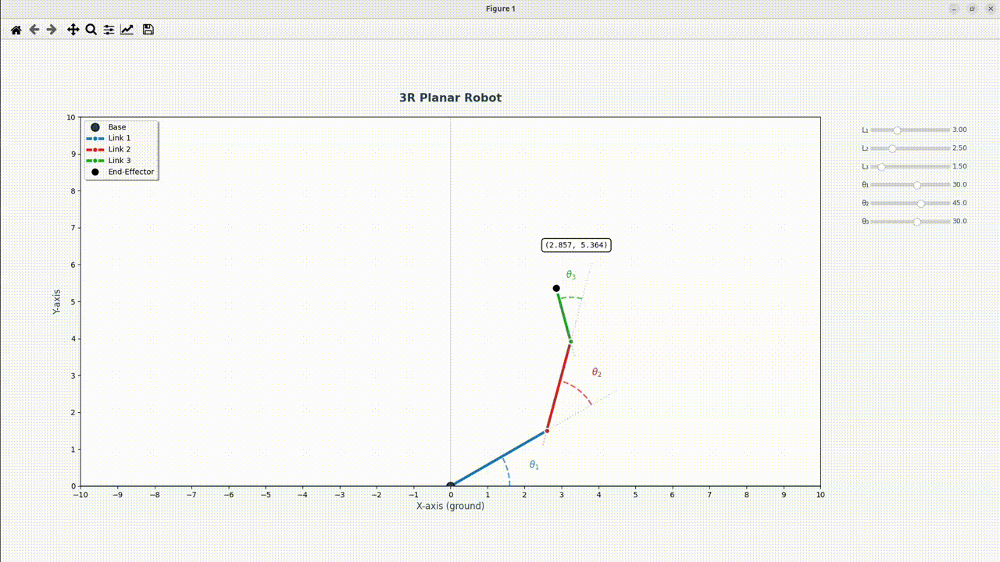
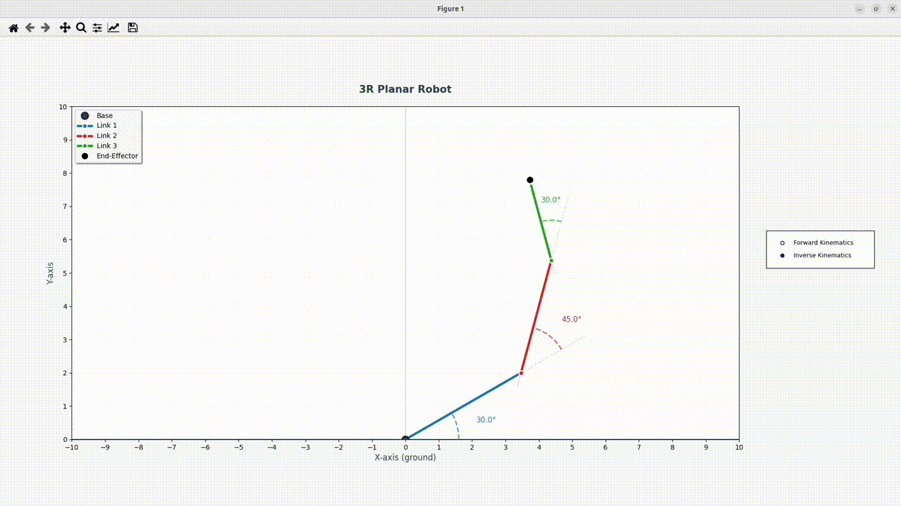

# Robot Arm Kinematics

Learning robot kinematics from first principles - building up from 2D to 3D, implementing Forward Kinematics (FK), Inverse Kinematics (IK), and Jacobians using pure Python and math.

---

## 3R Planar Robot : Forward Kinematics (2D)

Forward kinematics implementation from scratch for a 3R planar robot using Sympy and Matplotlib.

### Features
- Computes end-effector position using homogeneous transforms  
- Interactive visualisation

<br>
<div align="center">
  
  <p><em>Adjust joint angles and link lengths using sliders</em></p>
</div>

<br>

## 3R Planar Robot : Inverse Kinematics (2D)
Analytical IK solver using geometric approach with Law of Cosines.

### Equations
```
l₁·cos(θ₁) + l₂·cos(θ₁ + θ₂) = w_x
l₁·sin(θ₁) + l₂·sin(θ₁ + θ₂) = w_y
```

### Features
- Click anywhere to set target position
- Real-time IK solving with animation

<br>
<div align="center">
  
  <p><em>Click to set IK target</em></p>
</div>

### Run
```bash
python3 main.py
```